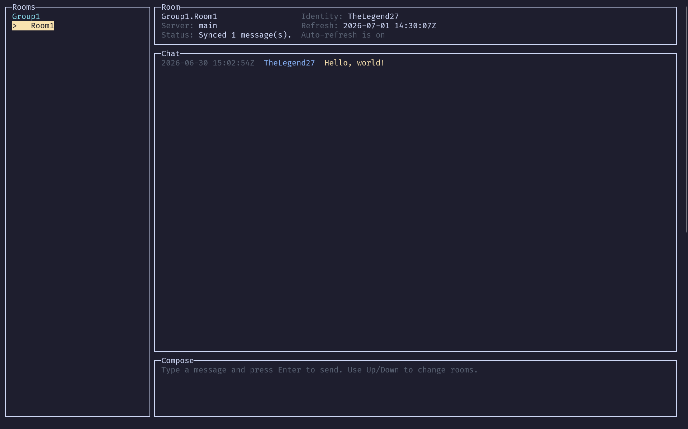

# brunt-toast/leaflet

Leaflet is a messaging app optimised for privacy and architecturally opposed to corporate-interest enshittification.

Every message, including metadata, is secured against prying eyes using end-to-end post-quantum encryption. Servers are volunteer-run, with robust erasure coding to make sure your chats live on, even if your favourite server dies. Configuration is encrypted, so even physical access to your PC or phone won't give attackers access to your chats or identities.

## 📋 Prerequisites

You'll need .NET 6 or higher to restore dependencies. See [script/dotnet-install.ps1](./script/dotnet-install.ps1) and [script/dotnet-install.sh](./script/dotnet-install.sh).

If you want to deploy an instance of the server, the easiest way is to do ith with [docker](docker.com).

## 🚀 Get started

* Get hooks using `git config core.hooksPath '$GIT_DIR/../hooks'`
* Restore tools using `dotnet tool restore`

## ▶️ Run

To start the client, use `dotnet cake --target RunClient`.

To start the server, use `dotnet cake --target RunServer`.

## 🧪 Test

To run all tests, use `dotnet cake --target Test`.

### 📊 Coverage

To generate a coverage report, use `dotnet cake --target GenerateCoverage`.

### 📈 Benchmarks

To run all benchmarks, use `dotnet cake --target Benchmark`.

This might take a while, so consider adding `--benchmarkFilter **Example**` too.

## 🐳 Deploy

To build and run the API in Linux containers, use `docker compose up --build`.

The API will be available at `http://localhost:5011`, and the SQLite database will be persisted in the named Docker volume `api-data`.

To stop the container, use `docker compose down`.

## ⚖️ Licensing

Released under the MIT license.

No third party notices apply.

For more information, see [LICENSE.md](./LICENSE.md).
